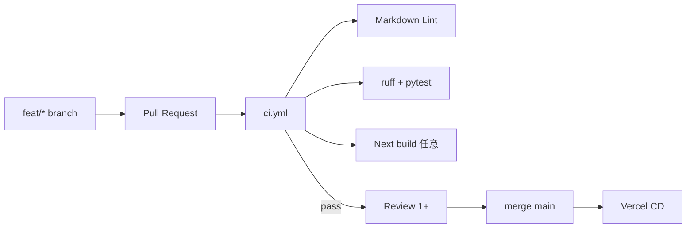
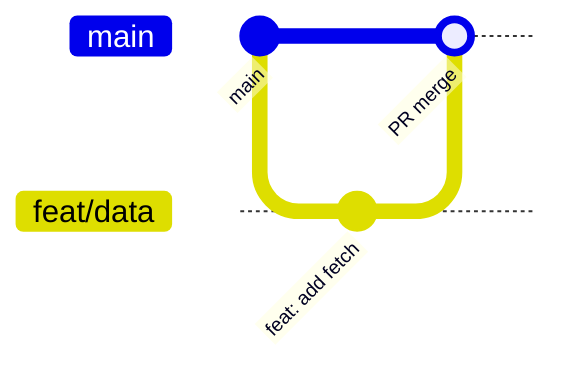

# Contributing / Development Guide

heat-town への貢献ガイド。大学 PBL / OSS 公開向け。

## はじめに

- 主役は **分析・考察・提言**。PoC は分析の出力ビューア
- 最初に [docs/00-project/overview.md](docs/00-project/overview.md) を読む
- 用語は [docs/GLOSSARY.md](docs/GLOSSARY.md) に統一
- doc 構成の追加は禁止。責務整理のみ

## CI/CD フロー



| 段階 | 仕組み | 目的 |
|------|--------|------|
| **CI** | GitHub Actions | 品質保証 |
| **CD** | Vercel GitHub 連携 | 静的 PoC 公開 |

**Actions から Vercel へ deploy しない**。過剰 DevOps 禁止。

### ワークフロー

| ファイル | 内容 |
|----------|------|
| `ci.yml` | PR 統合ゲート |
| `docs.yml` | Markdown Lint |
| `python.yml` | ruff, pytest, requirements |

詳細: [docs/operations.md](docs/operations.md)

## GitHub Flow



1. `main` から `feat/*` または `fix/*` を切る
2. 小さく commit → push
3. PR 作成（テンプレート記入）
4. CI 緑 + review 1 名
5. squash merge 推奨

## Pull Request ルール

- [ ] CI 全 pass
- [ ] [GLOSSARY.md](docs/GLOSSARY.md) の記号と一致
- [ ] doc 変更は実装と同一 PR（または doc のみ PR）
- [ ] データライセンス・個人情報なし
- [ ] AI 使用時はツール名と用途を PR 説明に 1 行

テンプレート: [.github/PULL_REQUEST_TEMPLATE.md](.github/PULL_REQUEST_TEMPLATE.md)

## Commit Convention

```
<type>: <summary>

type: docs | feat | fix | data | ci | refactor | test
```

例:

- `feat: add WBGT computation`
- `docs: update social-proposals`
- `ci: add markdown lint`

## データ取扱い

- 個人情報・非公開データは **コミット禁止**
- `data/raw/` は .gitignore（`data/samples/` のみ commit）
- 再取得手順: [data/README.md](data/README.md)

## レビュー基準

- 数式 \(J_i, d, C, w_k\) の整合
- pytest / CI 緑
- WBGT 推定の免責記載（新規 doc 追加時）
- 2〜3 日スコープを超える変更は Issue 合意

## AI Assisted Development

Cursor / Claude / ChatGPT / Gemini / Groq 使用時:

- PR 説明に使用ツールと用途
- 個人レポート付録で開示
- 数式・ライセンスは **人間が検証**

## ローカル開発

```bash
python3 -m venv .venv && source .venv/bin/activate   # Windows: .venv\Scripts\activate
pip install -r requirements.txt
pip install -e ".[dev]"
ruff check src tests
pytest
```

**依存関係の SSoT**: `requirements.txt` + `pyproject.toml`。Python **3.11**（`.python-version` / CI 準拠）。`uv.lock` / `poetry.lock` は commit しない。

チーム運営: [docs/delivery.md](docs/delivery.md)
