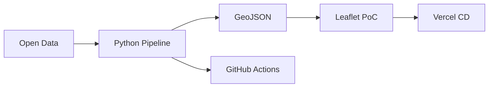

# heat-town — 都市熱環境における意思決定支援モデル

[](https://github.com/KanshoVector/Heat-Town/actions/workflows/ci.yml)
[](LICENSE)

## Overview

**heat-town** は、オープンデータと説明可能な多目的評価モデル \(J_i\) により、都市熱環境における意思決定を支援する大学データサイエンス PBL 向け OSS プロジェクトである。2〜3 日・6 人で完遂可能なスコープで、GitHub 公開品質の doc と PoC を成果とする。

> Web アプリ開発ではない。主役は **社会課題 → データ → 分析 → 提言**。MVP は分析結果を体験する PoC。

## Social Challenge

都市部では **距離（緑・日陰へのアクセス）・快適度・暑さ（WBGT）** が複合し、熱中症リスクと外出判断に影響する。単一の気温マップでは、行政・市民・都市計画者への **説明可能な優先介入** ができない。

## Decision Model

\[
J_i = w_1 \cdot d_i + w_2 \cdot (100 - C_i) + w_3 \cdot \text{WBGT}_i
\]

| 項 | 意味 |
|----|------|
| \(d_i\) | 正規化距離 |
| \(100 - C_i\) | 不快度 |
| \(\text{WBGT}_i\) | 暑さ指数 |

**低い \(J_i\) = より望ましい地点**。重みはペルソナ（一般・高齢者・猛暑日等）で調整可能。

## Architecture



Serverless First: DuckDB + 静的 PoC。CD は Vercel GitHub 連携のみ（Actions から deploy しない）。

## Quick Start

```bash
git clone https://github.com/KanshoVector/Heat-Town.git
cd Heat-Town
python3 -m venv .venv && source .venv/bin/activate
pip install -r requirements.txt
pip install -e ".[dev]"
pytest
cd mvp/public && python -m http.server 8080
```

## Documents

| ドキュメント | 内容 |
|--------------|------|
| [docs/00-project/overview.md](docs/00-project/overview.md) | **最初に読む** |
| [docs/GLOSSARY.md](docs/GLOSSARY.md) | 用語集 |
| [docs/README.md](docs/README.md) | 全 doc ナビ |
| [CONTRIBUTING.md](CONTRIBUTING.md) | 開発ガイド |

## Repository Structure

```
heat-town/
├── docs/                 # プロジェクト doc（フラット構成）
│   ├── 00-project/       # overview のみ
│   ├── GLOSSARY.md
│   └── *.md              # 社会課題〜運用
├── src/heat_town/        # Python 分析
├── data/                 # データカタログ
├── notebooks/            # 分析 notebook
├── mvp/                  # PoC ビューア
└── .github/workflows/    # CI（品質保証）
```

## Team

| 役割 | 人数 |
|------|------|
| PM | 1 |
| Data | 1 |
| Analysis | 2 |
| Model / Viz | 1 |
| MVP / DevOps | 1 |

詳細: [docs/00-project/overview.md](docs/00-project/overview.md)

## Quality Assurance

| バッジ | 内容 |
|--------|------|
| [](https://github.com/KanshoVector/Heat-Town/actions/workflows/ci.yml) | PR ゲート: Markdown Lint, ruff, pytest |

Build Status: [GitHub Actions](https://github.com/KanshoVector/Heat-Town/actions) — `ci.yml` が main の必須チェック。

Branch Protection: main は PR 必須・Status Check 必須・Review 1 名以上（[operations.md](docs/operations.md)）。

## License

[MIT License](LICENSE)
