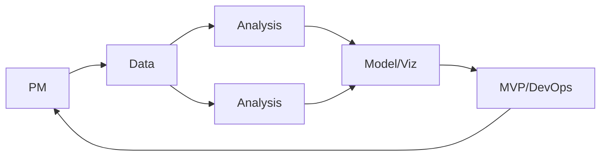
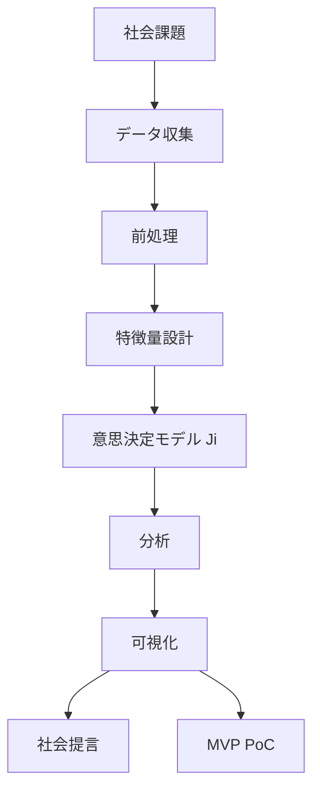

# プロジェクト概要

**heat-town** は、都市熱環境という社会課題に対し、オープンデータと説明可能な多目的評価モデル \(J_i\) で意思決定を支援する、大学データサイエンス PBL 向け OSS プロジェクトである。

> **全員が最初に読むファイル**。用語は [GLOSSARY.md](../GLOSSARY.md)、詳細は [docs/README.md](../README.md) を参照。

## 目的

| 観点 | 内容 |
|------|------|
| 社会 | 暑さリスクの高い地点を説明可能に特定し、行政・市民・都市計画の優先判断を支援する |
| 学術 | データ収集 → 前処理 → 特徴量 → モデル → 分析 → 可視化 → 考察 → 提言 の PBL 完遂 |
| 技術 | GitHub 公開可能な再現パイプライン + PoC（MVP） |

**本研究は Web アプリ開発ではない**。主役はデータサイエンスと社会提言である。

## 成果物

| 成果物 | 配置 | 評価での位置づけ |
|--------|------|------------------|
| プロジェクトドキュメント | `docs/` | 設計・分析・提言の根拠 |
| Python 分析パイプライン | `src/`, `notebooks/` | 再現性・分析 |
| MVP（PoC） | `mvp/` | 分析結果の体験（7 分デモ） |
| 7 分発表 | [delivery.md](../delivery.md) | 授業発表 |
| 個人レポート | [delivery.md](../delivery.md) | 個人評価 |
| 社会提言 | [social-proposals.md](../social-proposals.md) | 提言評価 |

## スコープ

**In Scope**

- Open-Meteo + OSM による \(d\), \(C\), WBGT
- 線形多目的モデル \(J_i = w_1 d + w_2(100-C) + w_3 \text{WBGT}\)
- Leaflet 静的 PoC、GitHub Actions による品質保証
- Vercel 静的ホスト（GitHub 連携、Actions からはデプロイしない）

**Out of Scope**

- 本番 Web アプリ・認証・リアルタイム API
- ニューラルネット・予測モデル・FFT（[rejected-approaches.md](../rejected-approaches.md)）
- Actions からの CD（デプロイ）

対象エリア: **1 都市・1 区または大学近傍 2km 四方**。評価点 500–2000。

## チーム（6 人）

| 役割 | 人数 | 主担当 |
|------|------|--------|
| PM / 問題定義 | 1 | overview, social-challenge, 発表統括 |
| データエンジニア | 1 | [data.md](../data.md), `data/` |
| 分析・特徴量 | 2 | [analysis.md](../analysis.md), `notebooks/` |
| モデル・可視化 | 1 | [decision-model.md](../decision-model.md), GeoJSON export |
| MVP / DevOps | 1 | [mvp.md](../mvp.md), CI, Vercel 連携 |

**全員**: PR レビュー、個人レポート、7 分発表の分担（1–2 分/人）。

## スケジュール（2〜3 日）

| Day | 午前 | 午後 | 夜 |
|-----|------|------|-----|
| **1** | キックオフ・overview 読了 | データ取得・前処理 E2E | \(J_i\) 試算・重み合意 |
| **2** | 仮説検証・感度分析 | GeoJSON + Leaflet 結合 | 社会提言ドラフト |
| **3** | CI 緑・Vercel 連携確認 | 7 分リハ・個人レポート | README 更新・main merge |

詳細チェックリスト: [delivery.md](../delivery.md#チームワークフロー)

## MVP の位置付け

| 区分 | MVP（本 PoC） | 本番アプリ |
|------|---------------|------------|
| 目的 | **分析結果を体験・説明** | 継続運用 |
| 実体 | Leaflet + 静的 GeoJSON ビューア | SaaS |
| 成功基準 | 7 分で \(J_i\) と寄与を説明できる | DAU / SLA |
| ホスト | Vercel（GitHub 連携） | 任意 |

MVP は分析パイプラインの **出力ビューア** に過ぎない。仕様: [mvp.md](../mvp.md)

## データサイエンスパイプライン

## 設計思想

Open Data First · OSS First · AI Assisted Development · Serverless First · MVP First · Explainability First · Reproducibility First

## 次に読むドキュメント

| 順 | ファイル |
|----|----------|
| 1 | [GLOSSARY.md](../GLOSSARY.md) |
| 2 | [social-challenge.md](../social-challenge.md) |
| 3 | 担当に応じ [docs/README.md](../README.md) の役割別ガイド |
