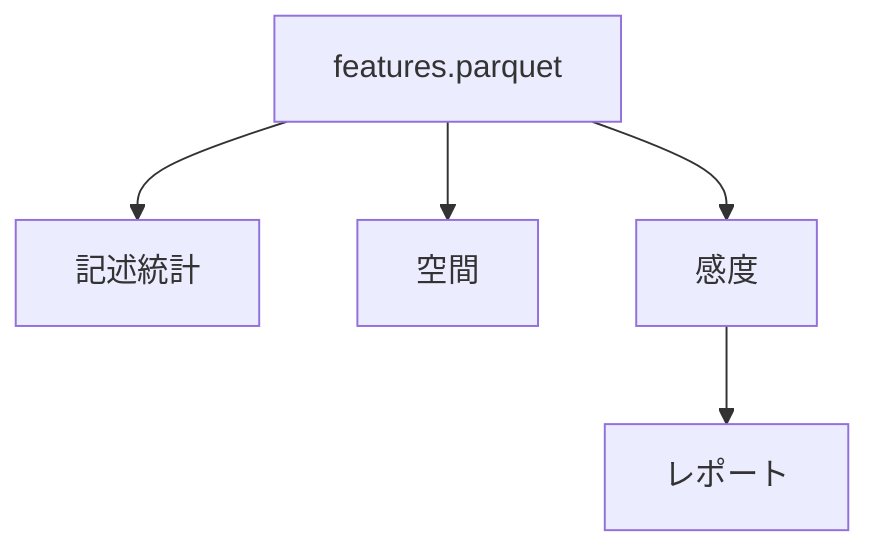

# 分析と可視化

## 研究仮説

| ID | 仮説 | 検証 |
|----|------|------|
| H1 | \(w_2\) 増で緑地周辺順位上昇 | プリセット比較 |
| H2 | 15 時の \(J_i\) が 8 時より大 | 時刻別分布 |
| H3 | POI 欠損区域で \(C\) 分散小 | 区域別分散 |
| H4 | `heat_alert` で WBGT 寄与 50% 超増 | 寄与分解 |

## 分析手順

### 記述統計

\(d, C, WBGT, J_i\) の mean / std / 分位。出力: `reports/descriptive_stats.md`

### 空間パターン

- \(J_i\) top 10% クラスタ
- 商業 / 住宅 / 公園近傍の箱ひげ

### 重み感度分析（Sensitivity Analysis）

1. baseline 順位
2. \(w_1, w_2, w_3\) グリッドスイープ
3. Kendall τ で順位安定性
4. 不安定地点 → 提言のトレードオフ



## 分析の限界

エコロジカルフォールシー、単都市、相関≠因果、WBGT 推定誤差 — 個人レポートで必ず記載。

---

## 可視化設計

### 目的

分析結果の **体験**。本番 SaaS UI ではない。

### Leaflet レイヤ

| レイヤ | データ |
|--------|--------|
| OSM タイル | ベース |
| \(J_i\) 点 | `mvp/public/data/scores.geojson` |
| POI | `parks.geojson` |

### 配色（\(J_i\) 低 = 良）

| 分位 | Hex |
|------|-----|
| 0–20% | `#2ecc71` |
| 60–80% | `#e67e22` |
| 80–100% | `#e74c3c` |

### Popup（Explainability）

```
Ji = 23.4
距離寄与: 4.2 | 不快寄与: 12.1 | 暑さ寄与: 7.1
```

### インタラクション

| UI | 動作 |
|----|------|
| 重みスライダー ×3 | クライアント側 \(J_i\) 再計算 |
| プリセット | `config/weights.yaml` |
| 時刻 | `scores_08h.geojson` 等 |

```javascript
function computeJ(f, w) {
  return w[0]*f.d + w[1]*(100-f.C) + w[2]*f.wbgt;
}
```

生成: `python -m heat_town.cli export-geojson`

次: [mvp.md](mvp.md) · [social-proposals.md](social-proposals.md)
