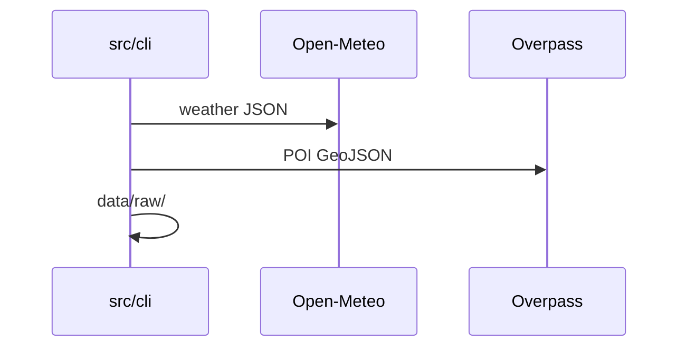
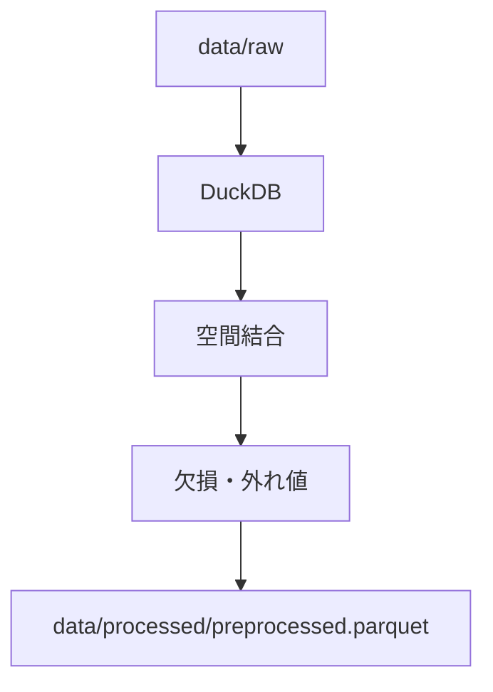

# データパイプライン

収集 → 前処理 → 特徴量設計を一貫して記述する。用語は [GLOSSARY.md](GLOSSARY.md)。

---

## データ収集

### Open Data First 方針

| 原則 | 実装 |
|------|------|
| ライセンス明確 | [data/README.md](../data/README.md) |
| 再取得可能 | `src/cli` スクリプト |
| 個人情報なし | 公開 POI のみ |

### データソース

| ソース | 取得項目 | 用途 |
|--------|----------|------|
| [Open-Meteo](https://open-meteo.com/) | 気温、湿度、風速 | WBGT, \(C_{\text{wind}}\) |
| OpenStreetMap | 公園、街路樹、建物 | \(d\), \(C\) |
| 行政 OD（任意） | 冷却スポット | 検証 |

```bash
python -m heat_town.cli fetch-weather --sample
python -m heat_town.cli fetch-poi --sample
python -m heat_town.cli build-grid
```

対象: 1 区または 2km 四方。評価点 500–2000。

### 取得フロー



### データ品質リスク

| リスク | 緩和 |
|--------|------|
| Open-Meteo 解像度 | 考察で明記 |
| OSM 欠損 | 欠損率レポート |
| WBGT 推定式 | 相対比較に限定 |

---

## 前処理

### パイプライン



| 項目 | 設定 |
|------|------|
| 入力 CRS | EPSG:4326 |
| 距離計算 | EPSG:6677（関東例） |
| origin | `config/origin.yaml` |

### 欠損・外れ値

| 列 | 欠損 | 外れ値 |
|----|------|--------|
| 気温・湿度 | 時間補間 | ±3σ clip |
| POI 距離 | \(d_{\max}\) cap | — |
| WBGT | 前後 1h 平均 | 0–40℃ |

### DuckDB テーブル

`weather_hourly`, `poi`, `grid`, `distances` — Parquet 統合。Serverless First。

---

## 特徴量設計

### 距離 d

\[
d_i = \frac{\text{dist}(origin, i)}{d_{\max}} \in [0, 1]
\]

### 快適度 C

\[
C_i = \text{clip}(\alpha C_{\text{shade}} + \beta C_{\text{green}} + \gamma C_{\text{wind}}, 0, 100)
\]

デフォルト: \(\alpha=0.4, \beta=0.4, \gamma=0.2\)。\(J_i\) 入力は \(100 - C_i\)。

### WBGT

\[
\text{WBGT}_i = 0.735 T + 0.0375 RH + 0.00292 T \cdot RH + 7.85
\]

### 特徴量一覧

| 特徴量 | \(J_i\) 項 |
|--------|------------|
| \(d_i\) | \(w_1 d_i\) |
| \(100 - C_i\) | \(w_2(100-C_i)\) |
| \(\text{WBGT}_i\) | \(w_3 \text{WBGT}_i\) |

出力: `data/processed/features.parquet` → [decision-model.md](decision-model.md)
