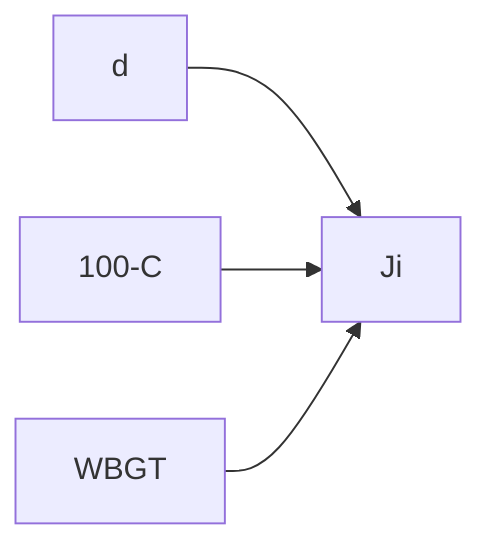

# 意思決定モデル

## モデル概要

\[
J_i = w_1 \cdot d_i + w_2 \cdot (100 - C_i) + w_3 \cdot \text{WBGT}_i
\]

| 記号 | 意味 | 方向 |
|------|------|------|
| \(J_i\) | 総合スコア | **低いほど望ましい** |
| \(d_i\) | 正規化距離 | 大→不利 |
| \(100 - C_i\) | 不快度 | 大→不利 |
| \(\text{WBGT}_i\) | 暑さ指数 | 大→不利 |

## 重み設定

| プリセット | \(w_1\) | \(w_2\) | \(w_3\) | 想定 |
|------------|---------|---------|---------|------|
| `balanced` | 0.3 | 0.4 | 0.3 | 一般 |
| `elderly` | 0.2 | 0.5 | 0.3 | 高齢者 |
| `commuter` | 0.5 | 0.2 | 0.3 | 通勤 |
| `heat_alert` | 0.2 | 0.2 | 0.6 | 猛暑日 |

設定: `config/weights.yaml`。\(w_1+w_2+w_3=1\), \(w_k \geq 0\)。

## Explainability — 寄与分解

\[
J_i = w_1 d_i + w_2(100-C_i) + w_3 \text{WBGT}_i
\]

PoC popup で 3 項を表示。重みスライダーで \(O(n)\) 再計算。

## 感度分析

重みスイープ、単項除去、時刻比較（8h / 12h / 15h）。詳細: [analysis.md](analysis.md)

## 限界

線形仮定、WBGT 推定、OSM 依存、因果非主張、点評価のみ。

不採用技術: [rejected-approaches.md](rejected-approaches.md)
