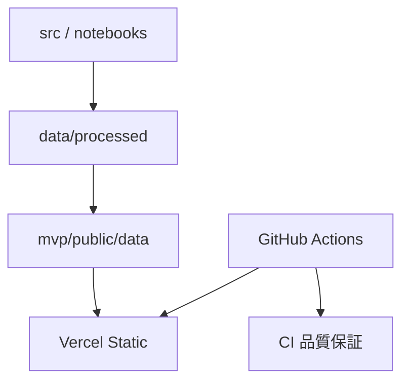
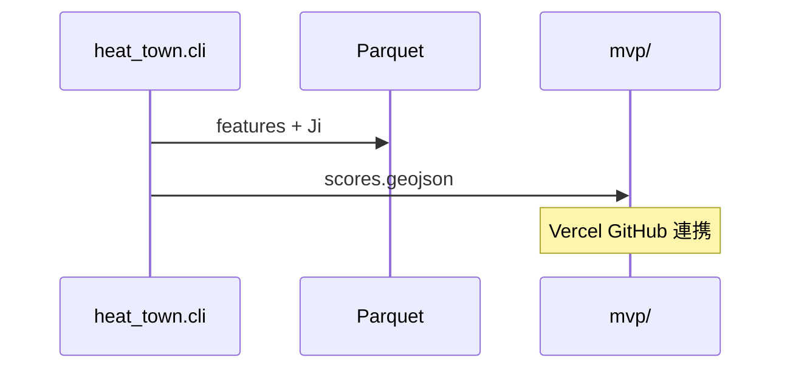

# MVP とアーキテクチャ

## MVP の位置づけ

| 区分 | PoC（本 MVP） | 本番アプリ |
|------|---------------|------------|
| 目的 | 分析結果の体験・説明 | 継続運用 |
| データ | 静的 GeoJSON | リアルタイム API |
| 成功 | 7 分デモで \(J_i\) 説明 | DAU / SLA |

**Web アプリ開発ではない**。フロントは分析の **出力ビューア**。

## 体験シナリオ（5 分）

1. 地図で \(J_i\) ヒートマップ
2. 高リスク地点クリック → 寄与 popup
3. `elderly` プリセット → 順位変化
4. 8h → 15h → 午後の WBGT 支配
5. 提言へ接続

## 画面・機能

| 領域 | 要素 |
|------|------|
| メイン | Leaflet 地図（70%） |
| サイド | 重みスライダー、プリセット、凡例 |

| ID | 要件 | 優先 |
|----|------|------|
| F1–F3 | GeoJSON、色分け、popup | Must |
| F4–F5 | スライダー、プリセット | Must |
| F6–F7 | 時刻、POI toggle | Should |

## 受入基準

- [ ] ローカル表示（`npm run dev` または `python -m http.server`）
- [ ] Vercel URL（GitHub 連携）で公開
- [ ] popup に寄与 3 行
- [ ] スライダー 1 秒以内更新

---

## Serverless アーキテクチャ

| コンポーネント | 責務 |
|----------------|------|
| `src/` | fetch, preprocess, score, export |
| `notebooks/` | 探索分析 |
| `mvp/` | Leaflet viewer |
| `.github/workflows/` | lint, test（**デプロイは Actions 外**） |

### データフロー

### CD 方針

- **CI**: GitHub Actions（品質保証）
- **CD**: Vercel の GitHub 連携のみ（main merge → 自動デプロイ）
- Actions から Vercel へ deploy **しない**

起動: [mvp/README.md](../mvp/README.md) · 運用: [operations.md](operations.md)
