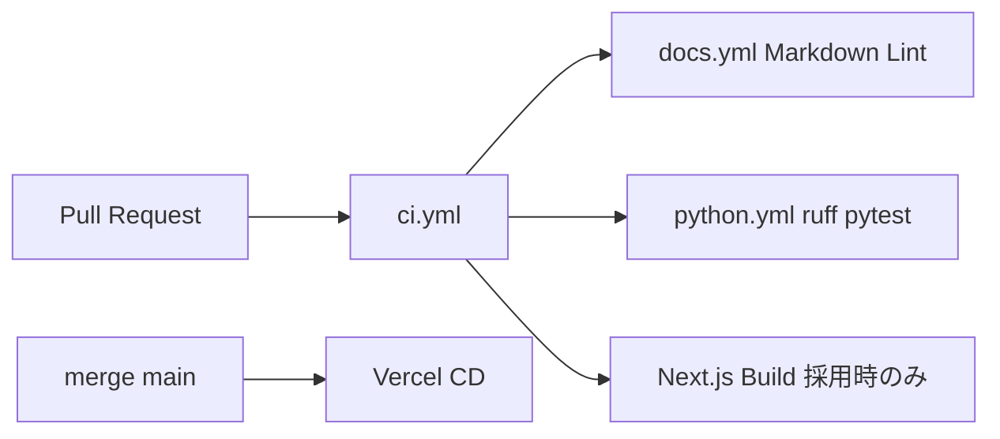

# 運用・技術・品質保証

設計思想、再現性、デプロイ、CI/CD を統合する。

---

## 設計思想（7 First）

| 思想 | 実装 |
|------|------|
| Open Data First | Open-Meteo, OSM |
| OSS First | MIT, GitHub |
| AI Assisted Development | ツール使用を PR / レポートで開示 |
| Serverless First | DuckDB ファイル、静的 PoC |
| MVP First | PoC のみ |
| Explainability First | 線形 \(J_i\) + 寄与 UI |
| Reproducibility First | Parquet, Actions, seed 42 |

## 技術スタック

| レイヤ | 技術 |
|--------|------|
| 分析 | Python 3.11+, Pandas, DuckDB |
| 気象 | Open-Meteo REST |
| 地図 | Leaflet |
| フロント | Next.js **または** HTML+JS |
| CI | GitHub Actions |
| ホスト | Vercel（GitHub 連携） |

---

## 再現性

```bash
git clone https://github.com/KanshoVector/Heat-Town.git
cd Heat-Town
python3 -m venv .venv && source .venv/bin/activate
pip install -r requirements.txt
pip install -e ".[dev]"
pytest
```

| パス | Git |
|------|-----|
| `data/samples/` | コミット |
| `data/raw/` | .gitignore |
| `data/processed/` | sample のみ |

乱数 seed: 42。座標 EPSG は config 固定。

---

## デプロイ（Vercel）

| 項目 | 値 |
|------|-----|
| Root | `mvp/` |
| 方式 | GitHub 連携（main → 自動） |
| 環境変数 | 不要（静的 GeoJSON） |

```bash
cd mvp && npm install && npm run dev   # Next.js 採用時
cd mvp/public && python -m http.server 8080  # HTML+JS
```

**CD は Actions から行わない**。Vercel ダッシュボードでリポジトリ連携。

---

## CI/CD（大学 PBL 最小構成）

### 目的

**品質保証**。デプロイは目的ではない。

### ワークフロー

| ファイル | 役割 |
|----------|------|
| `.github/workflows/ci.yml` | PR ゲート（docs + python + build） |
| `.github/workflows/docs.yml` | Markdown Lint |
| `.github/workflows/python.yml` | ruff + pytest + requirements install |



### PR 時チェック

- Markdown Lint
- ruff（Python）
- pytest
- requirements install 検証
- Next.js build（`mvp/next.config.js` 存在時のみ）

### Branch Protection（main）

GitHub Settings → Branches で設定:

| ルール | 設定 |
|--------|------|
| PR 必須 | ✅ |
| Status Check 必須 | `ci`（または docs + python） |
| Review | 1 名以上 |

---

## セキュリティ・コスト

API キー不要。Vercel Hobby + GitHub Free で $0。個人情報データ禁止。

詳細: [CONTRIBUTING.md](../CONTRIBUTING.md) · [data/README.md](../data/README.md)
